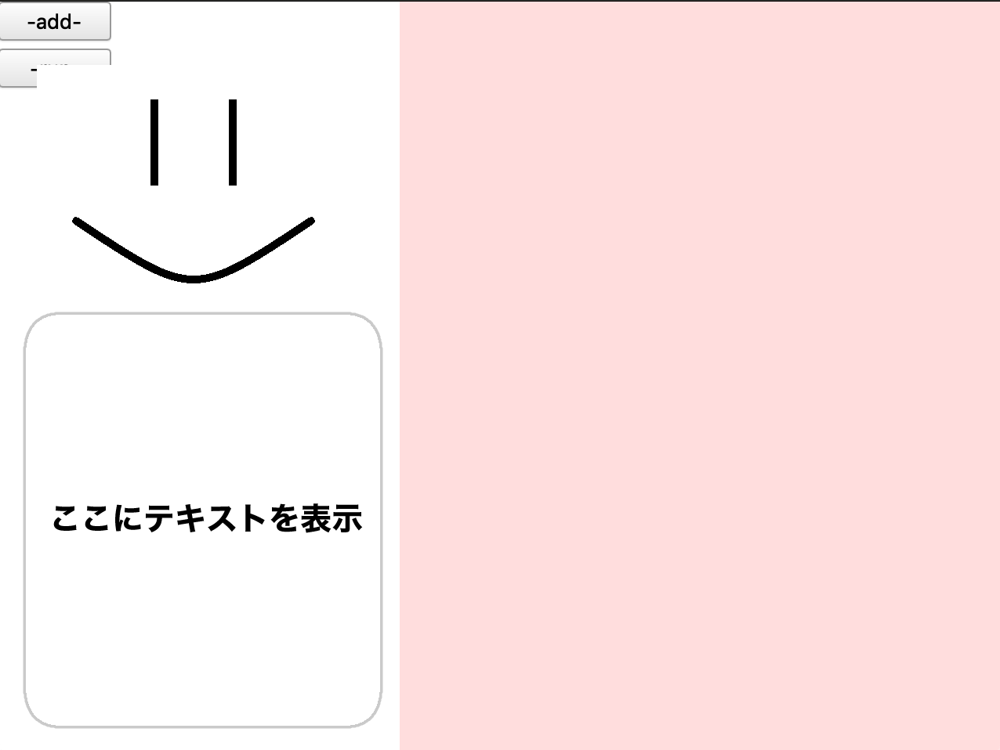
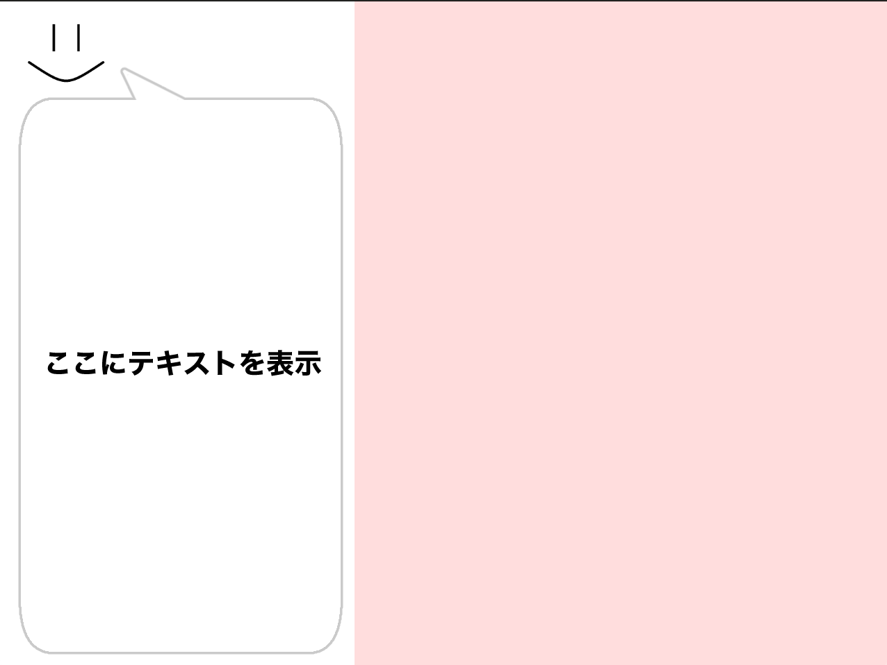
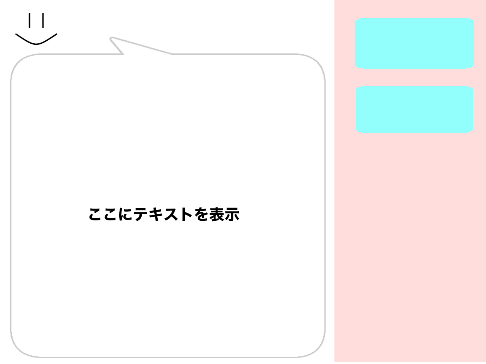
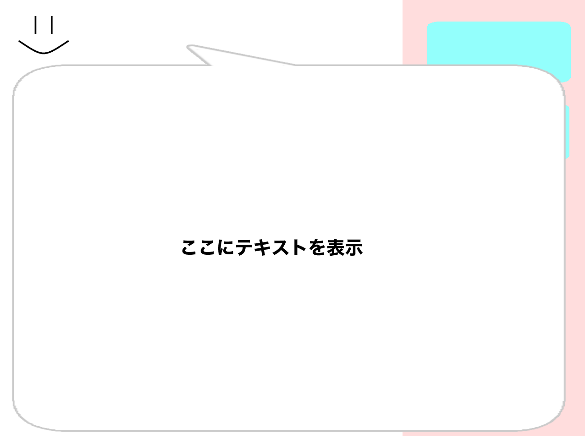
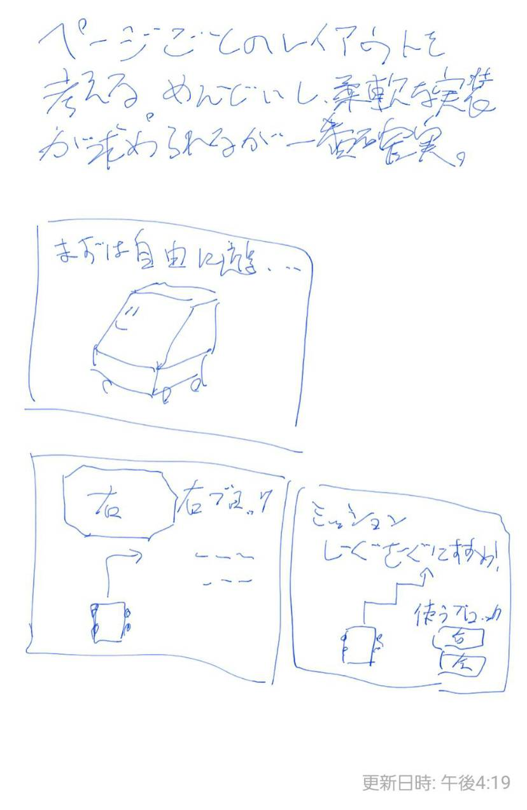
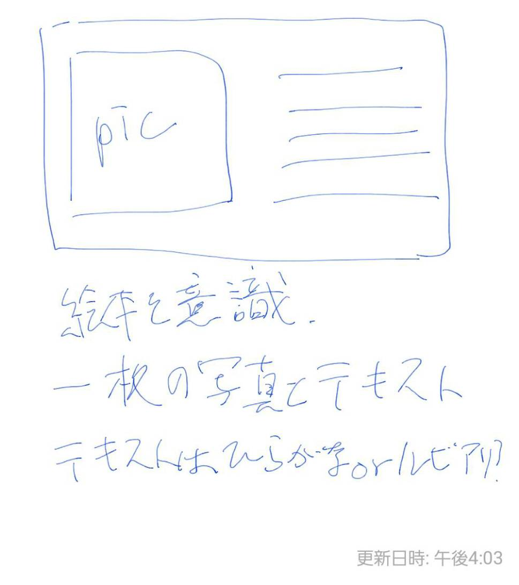

テキスト作成にあたって検討するべき項目についてまとめている。自分なりの意見がある時は各個人で項目に追加してほしい。

# 目次
- [表示領域](#sec1)
- [教科書レイアウト](#sec2)
- [教科書ページ切り替え](#sec3)
- [コンテンツ](#sec4)

## 表示領域の検討
<a>教科書の表示する位置や方式について検討する。</a>

1. eduの顔を上部にずらし残りの領域で描画を行う。狭い。

2. eduの顔を小さくもしくは無くして表示領域を拡大する。無くすのは個性的にありか？

3. プログラムブロックの表示領域を削減し、テキスト幅を拡大する。ブロックは見づらくなるが、もともとあまり使ってない領域であることは間違いない。

4. ポップアップまたは別画面としてテキストを表示する。画面幅を最大限に活かせる。その他の項目が見づらくなったり、画面切り替えが疎ましいという話はある。

## 教科書レイアウトの検討
子供にとって見やすいレイアウトとは、使いやすいレイアウトとは、という点と実装の難易度に重点を置いて検討する。

1. ページごとに自由なレイアウトを組めるようにする

メリットはコンテンツの自由度、デメリットはレイアウトを考えることの困難とQtでの実装の難易度。デメリットが大きく断念。

2. ページに置くViewを固定し、その中身だけを変更する。

1とメリットデメリットがだいたい逆。Qtでの実装を考えてこちらを採用していく方針。

## 教科書ページ切り替えの検討
テキストのページを切り替える必要が出てくるのは必然であるが、音声操作やタッチパネル操作の両観点からその方式を見当する必要がある。
->タッチパネルの精度からスライド式は難しい。よって、パワポのようなページ切り替え式を採用する。

## コンテンツ

1. とりあえず動かしてみる。 -- "前","後",'実行','一つ戻る'のコマンドだけを使って自由に挑戦してみる。
2. 右折左折。 -- "前"->"右"->"前"のように進むコマンドを組む
3. ゴールしてみよう。 -- 右3マス, 上4マスの場所に自由にゴールする

### 久野先生の研究室のとある方(名前忘れた…)のお話(あやふやな記憶)

>小学生低学年は課題だけで与えても自分たちであらゆる手段を自由に使って達成することが多い。小学生中学年以上になると、課題が分かってもやり方が知らない分からない自信ない時は手が止まってしまうことが多く、教わるまで待っていることが多い。

これを聞いて自分は低学年の子にはトライアンドエラーの精神は備わっているものと推測し、教える操作方法は最小限に、目標型の課題を多くしたいと思っている。
